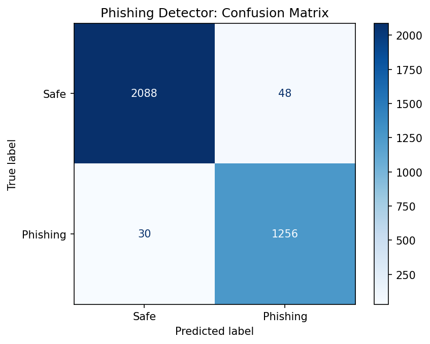
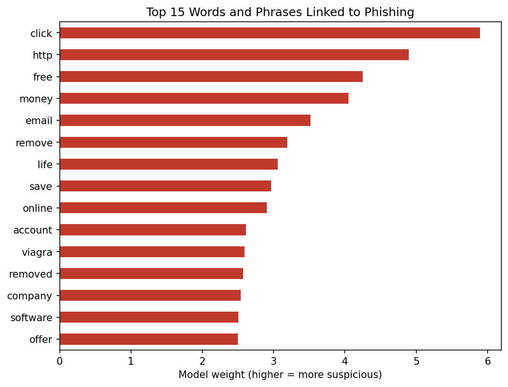

# Phishing Email Detector

A machine learning classifier that labels emails as **phishing** or **safe**, and identifies the language patterns attackers rely on.

Built with Python, scikit-learn, and pandas.

## Overview

Phishing is one of the most common ways attackers gain initial access to an organization. This project trains a TF-IDF and logistic regression model to detect phishing emails, then analyzes the model's learned weights to connect its decisions to real social engineering tactics.

## Results

Evaluated on a held-out test set of 3,422 emails (20% of the cleaned data):

| Class    | Precision | Recall | F1-score |
|----------|-----------|--------|----------|
| Safe     | 0.99      | 0.98   | 0.98     |
| Phishing | 0.96      | 0.98   | 0.97     |

**Overall accuracy: 98%**

- **Recall (0.98):** the model caught 98% of phishing emails in the test set.
- **Precision (0.96):** 96% of emails flagged as phishing were actually phishing.

The model produces more false alarms than missed attacks, which is the safer trade-off for a security tool, since a missed phishing email can lead to compromised credentials or malware.



## Security Analysis

Because logistic regression is interpretable, each word's weight shows how strongly it pushes an email toward "phishing." The top indicators map to well-known social engineering tactics:

| Tactic | Indicators | Description |
|--------|-----------|-------------|
| Call to action | click | Pressures the reader to act before thinking |
| Financial lure | free, money, save, offer | Promises a reward to lower the reader's guard |
| Credential bait | account, email, online | Implies an account issue to prompt a login |
| Bulk spam markers | remove, viagra, software | Unsubscribe bait, pharmacy and pirated software spam |



**Obfuscated links:** properly formatted URLs (normalized to `urltoken` during cleaning) were associated with *safe* emails, while the leftover string `http` was a strong phishing signal. This suggests attackers broke up links (for example, `http : / / site . com`) to evade filters.

## Methodology

1. **Data cleaning:** removed an unused index column, missing values, and 1,543 duplicate emails to prevent data leakage, leaving 17,107 emails (10,676 safe, 6,431 phishing).
2. **Text normalization:** lowercased text and replaced URLs, email addresses, and numbers with placeholder tokens so the model learns patterns rather than memorizing specific values.
3. **Train/test split:** 80/20, stratified to preserve the class ratio, with a fixed random seed for reproducibility.
4. **Feature extraction:** TF-IDF on single words and two-word phrases, with English stop words removed.
5. **Model:** logistic regression with balanced class weights to account for the 62/38 class imbalance.

## Limitations

- **Dataset bias:** the strongest "safe" indicators included *enron*, *vince*, *louise*, *linguistics*, and *university*. These reflect the sources of the safe emails (the Enron email corpus and an academic mailing list), not genuine signs of safe email. Part of the model's high accuracy likely comes from these shortcuts, so performance on modern corporate email would probably be lower.
- **Spam vs. phishing:** some phishing-labeled emails appear to be general spam, so the model may be better at detecting bulk spam than targeted spear phishing.
- **Text only:** the model doesn't analyze sender addresses, headers, or attachments, which real email security tools rely on.

## Future Work

- Remove dataset-specific terms and retrain to measure the impact of dataset bias
- Test on a more modern phishing dataset
- Add email header features such as sender domain and reply-to mismatches

## How to Run

```bash
git clone https://github.com/TerranceDessaure/phishing-email-detector.git
cd phishing-email-detector
python3 -m venv .venv
source .venv/bin/activate
pip install -r requirements.txt
```

Download the dataset from [Kaggle: Phishing Email Detection](https://www.kaggle.com/datasets/subhajournal/phishingemails) and place `Phishing_Email.csv` in a `data/` folder. Then run:

```bash
python phishing_detector.py
```

## Dataset

[Phishing Email Detection](https://www.kaggle.com/datasets/subhajournal/phishingemails) on Kaggle, used under its stated license. The dataset is not included in this repository.

## Author

**Terrance Dessaure**, Information Science and Technology student at the University of South Carolina Beaufort